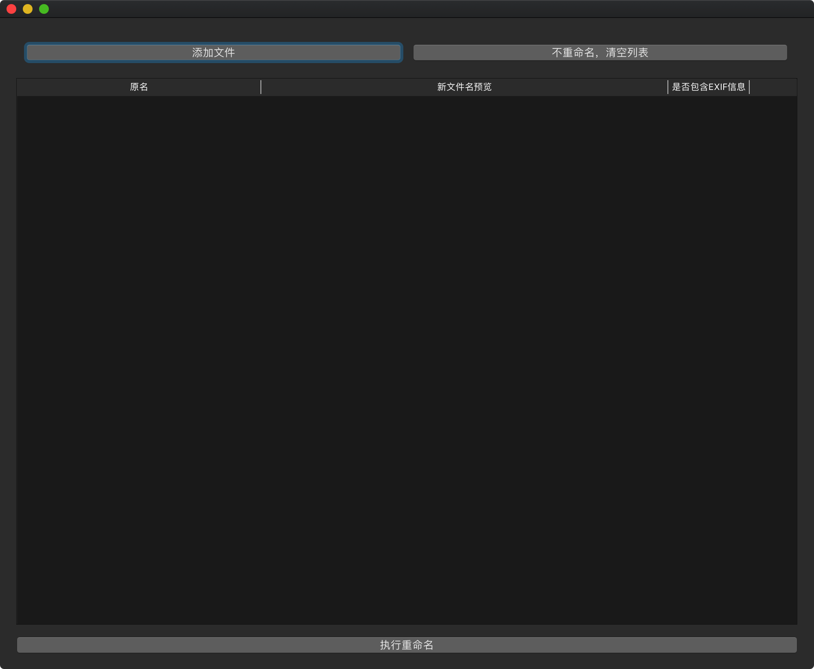
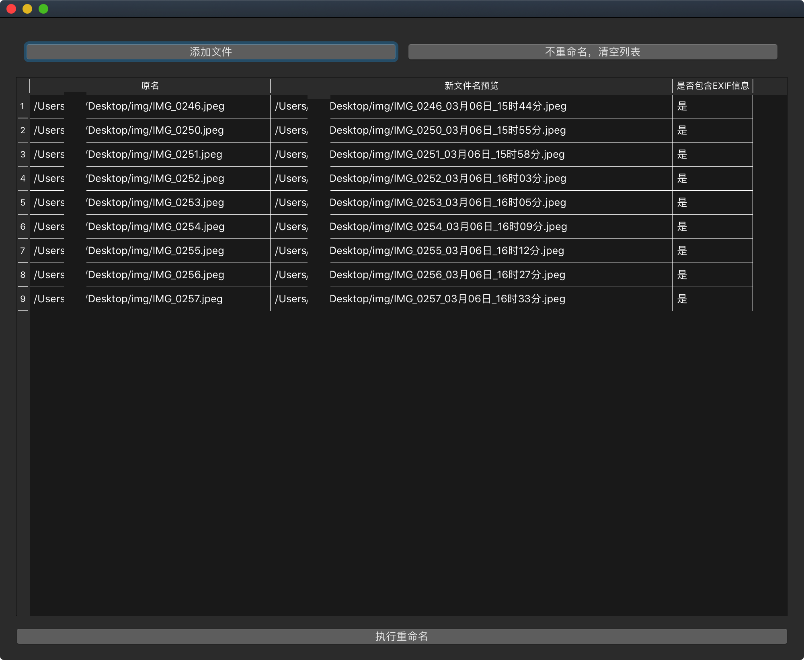

# 说明

[TOC]


## 功能

自动根据照片的EXIF信息，在照片文件名后添加拍摄日期（月、日）和时间（时、分）

## 运行方式

```bash
python3 main.py
```

## 运行截图






## 依赖

见requirements.txt

## 注意事项

重命名必须依赖EXIF信息

- 安卓通用：手机拍摄的照片可以使用微信，发送原图到电脑。

- iPhone部分适用：iPhone 7之后的机型，默认照片格式为HEIC，通过微信发送到电脑会丢失EXIF信息，解决方法待寻， 有条件可以使用Airdrop。其他机型可使用安卓传输方式。

## 已知缺漏

- Mac端ExifPic.app第一次运行会疑似闪退，无需任何操作，会自动重新启动

## 邮箱

beardwatt@gmail.com